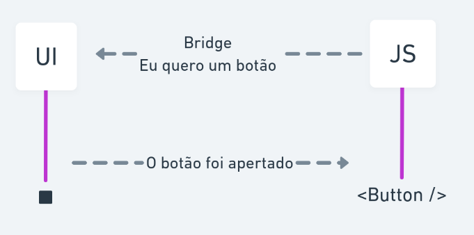

# React Native

React Native é um framework que utiliza o React para construção de aplicações mobile hibridas, utilizando apenas o javaScript podemos construir aplicações para IOS e Android.


## Como o React Native Funciona 

- O javaScript é transformado em um 'pacote'
	- Transpilado e reduzido

- Os elementos de interface UI são separado do javaScript 

- Comunicação assíncrona com a "bridge" 
	- O Js solicita a renderização dos elementos de interface  


<p  align="center">

</p>


## Diferenças entre o React Native e o React 

- Componentes bases, no React os componentes bases são as div, section, entre outros já no React Native os elementos são a view, title e etc

- Não tem Api do navegador 
	- Não tem animações com CSS, canvas e etc. 

- Navegação entre telas 

## Componentes React Native 

[Documentação React Native](https://reactnative.dev/)

- Os componentes de base como texto, input e etc não ficam no escopo global, precisam ser  importados `import from 'react-native'`
- div -> View

- snap -> Text

- button -> Button 

- ScrollView

## Estilização dos componentes 

- React Native utiliza um objeto javaScript para estilização 

- As chaves do objeto são a propriedade CSS

```jsx 
	import {View} from 'react-native
	
	...
	
	<View style={{marginTop: 10, padding: 20 ....}}> 
		....
	</View>
```

- Estilos podem ser passados em formato de array 

- O Flexbox já é o padrão da interface do React Native
	- Vem como padrão também o `flex-direction: column`

- StyleSheet.create()
	- Funciona da mesma maneira de estilizar o componente com um objeto, porem utilizando para criar um objeto só que contem as estilizações 
	
	- Adiciona optimização na renderização 
	
```jsx 
	import {StyleSheet, View} from 'react-native
	
	...
	
	<View style={styles.container}> 
		....
	</View>	 
	
	const styles = StyleSheet.create({
		container: {
			marginTop: 10, 
			padding: 20
		}
	})
```

## Manipulação de Eventos 

- Diferente da web nem todo componente tem interação

- Apenas componentes "clicáveis" 
	- Button
	- TouchableOpacity, TouchableHiglight, TouchableWithoutFeedback
	- TouchableNativeFeedback (Android)


## Expo 

Expo é uma forma de acelerar o desenvolvimento de uma aplicação utilizando o React Native, podemos executar nossas aplicações através da web utilizando o [snack](https://snack.expo.io/) mas também podemos executar em nosso Smartphone baixando o app do expo, para utilizarmos o expo precisamos instalar o CLI dele para criarmos nossos apps através dele.

## PropTypes 

[Documentação PropTypes](https://github.com/facebook/prop-types)  

PropTypes é uma forma de usarmos a própria biblioteca do React para documentar nosso código, com propTypes definimos qual é o nome do parâmetro e qual é o tipo de dado que ele recebe. 
