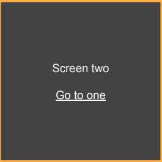

#  Navegação

## O que é a navegação ? 

[Documentação React Navigation](https://reactnavigation.org/docs/getting-started)

-	Navegação é um longo termo que cobre alguns tópicos de como vamos nos mover entre as telas do App

-	Na web a navegação é orientada por URLs no app mobile não utilizamos URLs para nos movermos entre as telas 

-	A API de navegação é completamente diferente entre o  IOS e Android

	-	Entretanto o React Native nos prove uma biblioteca independente que nos ajuda a resolver este problema chamada React Navigation 

## Navigators, routes 

- Navigators é um componente onde implementamos o padrão  da navegação exemplo: tabs, stack ...

- Cada "navigator" deve ter uma ou mais rotas 
	- "navigator" é o pai de uma "route"

	-  "route" é um filho do "navigator" 
- Cada "route" tem um nome e um componente que será renderizado em tela

	- O nome normalmente é único no app
	
	- O componente é exibido enquanto a "route" estiver ativa

## Switch Navigator

[Documentação Switch Navigator](https://reactnavigation.org/docs/upgrading-from-4.x/#switch-navigator)

-	Exibe uma tela de cada vez 
-	Telas que já não estão sendo exibidas são "desmontadas" 
-	A unica coisa que o usuário pode fazer é trocar de uma tela para outra

## Stack Navigator

[Documentação Stack Navigator](https://reactnavigation.org/docs/4.x/stack-navigator-1.0/)

- Exibe uma tela de cada vez
- Telas já exibidas são mantidas em "pilha" para serem remontadas 
- Através das ações do usuário podemos colocar mais telas neste pilha, mudar a posição dela ou até remover ela da "pilha" 

## Tab Navigator 

[Documentação Tab Navigator](https://reactnavigation.org/docs/4.x/tab-based-navigation)

- É exibido uma tela de cada vez 
- O estado das telas que não estão sendo exibidas é mantida 

