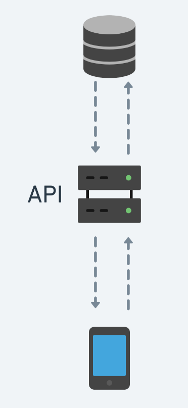

#  Data

- Nem todos os Apps contem as informações necessárias armazenadas em memoria

- Quando precisamos de informações que não estão armazenadas podemos pegar isto de algum lugar
	-   Podemos pegar estas informações utilizando uma API

## API

[Exemplo de API (Rando User)](https://randomuser.me/)

- Application Programming Interface [Interface de Programação de Aplicativos]
- Podemos mandar e receber dados e com isso decidir o que queremos fazer 

<p  align="center">

</p> 


## Fazendo uma requisição 

[Mozilla Fetch_API](https://developer.mozilla.org/pt-BR/docs/Web/API/Fetch_API/Using_Fetch)

- fecth() é "polyfillled"

	- "polyfilled" é quando a funcionalidade não é nativa mas os outros usuários implementaram para nós utilizarmos, o fetch é nativo do navegador porem implementaram a funcionalidade no React Native

 - fecth() espera uma URL como primeiro parâmetro e opcionalmente alguma configuração   

- fetch() retorna uma promisse 


## Promisses 

[Mozilla Promise](https://developer.mozilla.org/pt-BR/docs/Web/JavaScript/Reference/Global_Objects/Promise)

- Permite a escrita assíncrona sem bloquear o código

- Permite que chamamos callback para lidar com erros e com a resposta 
	- .then() - executa depois do retorno do bloco da promisse anterior 
	- .catch() - executa quando acontece algum erro 

```javascript
	fetch('https://randomuser.me/api/').then(resposta => console.log(resposta))
 ```

## Async/Await

É uma maneira de substituir as promisses e deixar o código mais limpo e fácil de compreender, ao invés de ficar utilizando o .then() encadeado das promisses podemos utilizar o await e "esperar" a resposta porem para o await funcionar precisamos estar em um contexto Async 

```javascript
	async function pegarDados(){
		const resposta = await fetch('https://randomuser.me/api/')
		console.log(resposta)
	}
 ```

## Métodos HTTP 

[Mozilla Metódos HTTP](https://developer.mozilla.org/pt-BR/docs/Web/HTTP/Methods)

### GET

- É o método padrão de requisição dos navegadores e do fetch()

- Podemos adicionar parâmetros em nossa URL adicionando ? e com a sintaxe de `chave=valor` e caso seja mais de 1 separamos eles por & 

```javascript
	fetch('https://randomuser.me/api/?results=50&gender=female')
 ```

### POST

- Maneira de enviarmos dados para um endpoint 

- Os parâmetros são enviado no corpo da requisição 
- Caso for enviar um objeto no formato de Json precisa informar isso no header da requisição e então passar as informações no corpo

```javascript
	fetch('algumaUrl', {
		method: 'POST',
		headers: {'content-type': 'application/json'},
		body: {...}	
	})
 ```

## Códigos de resposta HTTP

[Mozilla códigos HTTP](https://developer.mozilla.org/pt-BR/docs/Web/HTTP/Status)
[HTTP CAT](https://http.cat/)

- Todas as respostas de uma requisição tem um código associado ao tipo do retorno
	- 200: OK 
	- 400: Bad Request 
	- 403: Forbidden 
	- 404: Not Found 
	- 500: Internal Server Error 
	- 418: I’m a teapot

