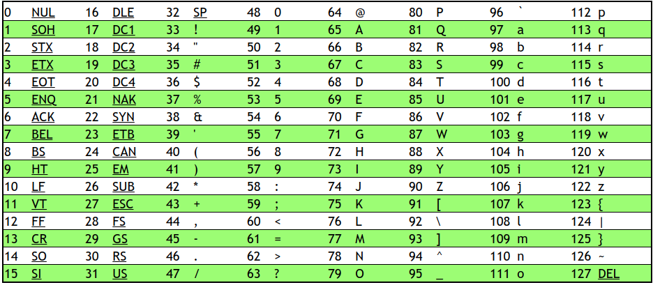

# Introdução

## Sistema binário 

O computador utiliza o sistema binário para controlar todas as coisas, esse sistema consiste em representar os números utilizando apenas 0 e 1, por mais estranho que pareça as diferenças não são tão grandes.
Veja o exemplo:
```
100       10         1
      
1        2         3
	    
100 * 1   10 * 2    10 * 3
	
```

Utilizamos no dia a dia a base 10 para representar os números, isso significa que podemos representar os números da seguinte forma:

```
      10^2       10^1        10^0
      
	    #        #         #
	    
```

Para alterarmos a forma de representação numérica de decimal para binária precisamos apenas alterar a nossa base de 10 para 2

```
       2^2       2^1       2^0
      
	    #        #         #
	    
```
Com isso conseguimos representar qualquer número utilizando o sistema binário, veja abaixo: 
```
# número 1

	    4      2      1
      
(R)	    0      0      1

# número 2

	    4      2      1
      
(R)	    0      1      0
	    
# número 3

	    4      2      1
      
(R)	    0      1      1

# número 4

	    4      2      1
      
(R)	    1      0      1

```
Assim utilizando apenas 3 bits (3 dígitos de 0 a 1), conseguimos representar 8 possibilidades.

## Representação do Alfabeto

Conseguimos ver que representar números não é algo tão complicado, porém precisamos representar o alfabeto também e para isso ocorrer foi inventado o padrão ASCII (American Standard Code For Information Interchange), e no padrão foi definido que o **A** séria o número **65** ou **01000001** e assim por diante. Entretanto para evitar conflitos o computador utiliza de contextos para saber quando utiliza o **01000001** como número ou como **A**.

<p  align="center">
	
</p>


Porém utilizar o ASCII tem alguns problemas, pois não era possível representação de acentuação tornando assim útil apenas para o inglês. Atualmente utilizamos um sistema chamado **Unicode** que possibilita a representação de muito mais caracteres.


## Algoritmos 

Algoritmos são a forma de "falarmos" para o computador quais os passos que ele deve seguir, podemos ter diversos algoritmos para resolver o mesmo problema porém precisamos sempre buscar o algoritmo que melhor nos atende em determinada atividade.


## Pseudocódigo

Pseudocódigo são uma forma de escrevermos o algoritmo em uma linguagem mais natural, ou seja, uma forma onde podemos fazer uma abstração sem precisar pensar na tecnologia em que o algoritmo seja implementado em si.

