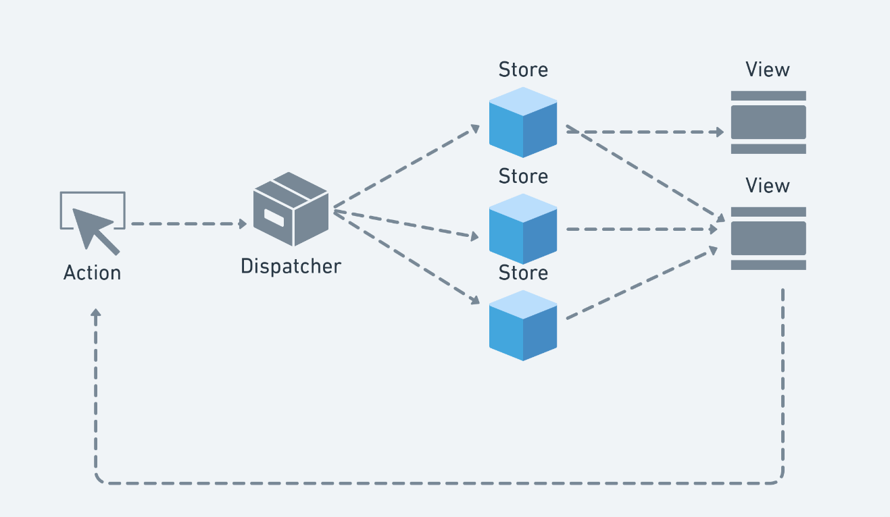
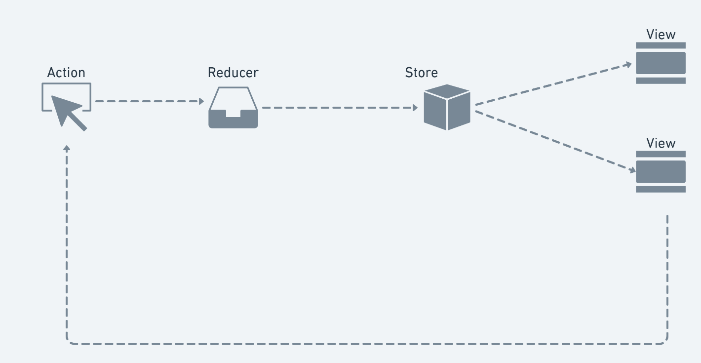

#  Redux

## Escalabilidade e complexidade 

Quando projetamos apps simples conseguimos facilmente gerenciar todos os seus estados e caso aconteça algum bug é relativamente fácil consertamos, porém quando a complexidade dos app aumenta começa a ficar complicado o gerenciamento de estados, passar props, se preocupar com informações duplicadas entre diversas outras coisas. 

## Arquitetura Flux 

- Uma arquitetura utilizando um fluxo de dados unidirecional 
	- Criamos locais onde armazenamos os dados que são chamados de "store"
	- Estes dados só podem ser mudados a partir de "dispatcher"
	- Estes "dispatcher" são acionados através de "actions"
	- As "actions" são disparadas através da interação nas "views"
	- A partir de uma "store" pode ter uma ou varias "views" que buscam informações 

## Redux

[Redux Doc](https://redux.js.org/)

- Foi inspirado na arquitetura Flux 
- Há apenas uma fonte da verdadeira informação 
- O estado desta informação só pode ser mudado por "actions"
- As atualizações são feitas utilizando funções puras 
- Action -> Reducer -> Update Store 

### Reducer 

- É responsável por atualizar o estado 
- Pega o estado anterior e atualiza as informações
- É uma função pura 

### Store 

- Store é responsável por manter o estado 
- Revela o estado através do getState()
- Só pode ser atualizado utilizando o dispatch()  

### Actions

- Geralmente as actions indica o tipo da ação que se deseja fazer, onde você deseja atualizar o estado 
- Geralmente o tipo da ação vai em uma chave chamada `type`
