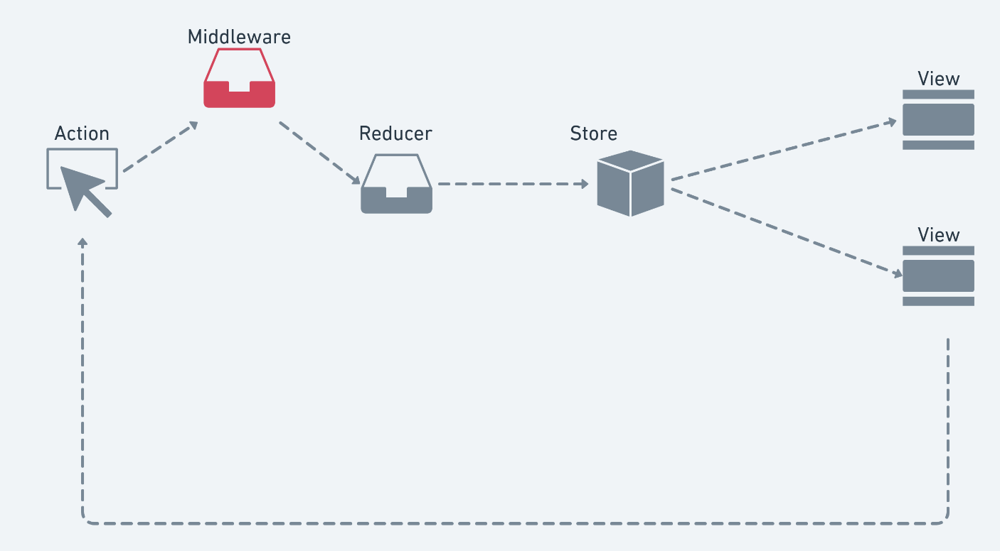

# Redux Assíncrono

## Suporte a requisições assíncronas
[Documentação Redux Async](https://redux.js.org/advanced/async-actions)

Para ter o suporte ao assincronismo precisamos garantir que a nossa implementação esteja dando suporte a isto. 

- Onde precisamos adicionar o suporte a isto ? 
	- Reducers 
	
	- Store
	
	- Actions
	
- Precisamos mudar mais do que simplesmente as "Actions"

- Store.dispatch() precisa aceitar outros tipos

## Redux Middleware 

[Documentação Redux Middleware](https://redux.js.org/advanced/middleware)

- Isto é uma forma de nos adicionarmos o assincronismo sem necessitar mudar toda nossa implementação 

-  Qualquer função com este protótipo pode ser middleware
	 - ({getState, dispatch}) => next => action => void 
	 
- Podemos implementar nosso recurso como middleware

## Persistência de dados 
[Documentação async-storage](https://github.com/react-native-community/async-storage)
Quando utilizamos o redux ou na maioria dos nossos app queremos que algumas informações fiquem salvas no dispositivo para facilitar o uso do app, para fazer isso o React Native nos da o async-storage.

## redux-persist

[Redux Persist](https://github.com/rt2zz/redux-persist)

## Todos os app precisam de Redux ? 

- O Redux nos ajuda a escalabilidade de nossa aplicação porem ele é complexo 

- As vezes aumentar muito a complexidade do projeto não vale a pena 

- Tente aproveitar o máximo o estado de suas aplicações e utiliza o Redux em seus "pontos de dor"